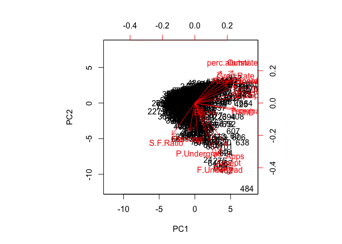
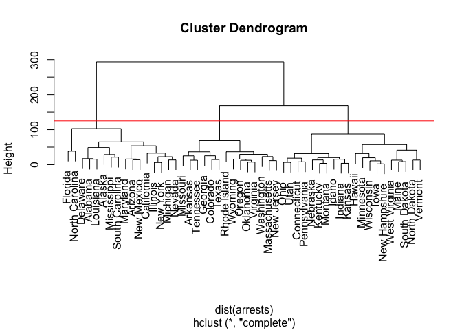

Unsupervised Learning
================
Jo Denby
2017-12-01

#### Colleges

``` r
library(tidyverse)
college <- read_csv("College.csv") %>%
  select(-Private)
```

##### 1.

``` r
pccollege <- prcomp(college, scale = TRUE)
biplot(pccollege, scale = 0)
```



Based on this biplot, the first principal component indicates that the variables with the strongest correlation are `Top 10Percent`, `Top 25Percent`, `Expend`, `Terminal`, `PhD`, and `Outstate`. For the second component, the `perc.alumni` and `Outstate` variables are those most strongly correlated with the principal component, with `F.Undergrad`, `Apps`, `Accept`, and `Enroll` having the comparably strong negative correlations.

##### 2.

``` r
pccollege_var <- pccollege$sdev^2
pccollege_pve <- pccollege_var/sum(pccollege_var)
pccollege_pve
```

    ##  [1] 0.320206282 0.263402144 0.069009166 0.059229892 0.054884051
    ##  [6] 0.049847010 0.035588715 0.034536213 0.031172337 0.023751915
    ## [11] 0.018414263 0.012960414 0.009857541 0.008458423 0.005171256
    ## [16] 0.002157540 0.001352837

This vector describes the proportion of the dataset's variance explained by each of the 17 principal components.

``` r
pccollege_pve[1] + pccollege_pve[2]
```

    ## [1] 0.5836084

By adding the first two values together, we can compute the proportion of the dataset's variance explained by the first two principal components (plotted above). The calculation shows that approximately 58% of the variance is explained by the first two components.

#### States

``` r
arrests <- read_csv("USArrests.csv") %>%
  tibble::column_to_rownames("State")
```

    ## Warning: Setting row names on a tibble is deprecated.

##### 1.

``` r
pcarrests <- prcomp(arrests, scale = TRUE)
biplot(pcarrests, scale = 0)
```


##### 2.

``` r
arrestsk2 <- kmeans(arrests, 2, nstart=20)
#pcarrestsk2 <- prcomp(arrestsk2, scale = TRUE)

#biplot(pcarrests, col = c(1,2), scale = TRUE)
```

##### 5.

``` r
pcarrests12 <- pcarrests$rotation %>%
  as.data.frame() %>%
  select(c("PC1", "PC2"))

# pcarrestsk2 <- kmeans(pcarrests12,3,nstart = 20)
# biplot(pcarrestsk2)
```

##### 6.

``` r
arrestshier <- hclust(dist(arrests), method = 'complete')
plot(arrestshier)
```


##### 7.

``` r
plot(arrestshier)
abline(h=125, col = 'red')
```

 By cutting at approximately 125, we group the states into three distinct clusters.

Here, R outputs which state belongs to which cluster.

``` r
cutree(arrestshier,3)
```

    ##        Alabama         Alaska        Arizona       Arkansas     California 
    ##              1              1              1              2              1 
    ##       Colorado    Connecticut       Delaware        Florida        Georgia 
    ##              2              3              1              1              2 
    ##         Hawaii          Idaho       Illinois        Indiana           Iowa 
    ##              3              3              1              3              3 
    ##         Kansas       Kentucky      Louisiana          Maine       Maryland 
    ##              3              3              1              3              1 
    ##  Massachusetts       Michigan      Minnesota    Mississippi       Missouri 
    ##              2              1              3              1              2 
    ##        Montana       Nebraska         Nevada  New Hampshire     New Jersey 
    ##              3              3              1              3              2 
    ##     New Mexico       New York North Carolina   North Dakota           Ohio 
    ##              1              1              1              3              3 
    ##       Oklahoma         Oregon   Pennsylvania   Rhode Island South Carolina 
    ##              2              2              3              2              1 
    ##   South Dakota      Tennessee          Texas           Utah        Vermont 
    ##              3              2              2              3              3 
    ##       Virginia     Washington  West Virginia      Wisconsin        Wyoming 
    ##              2              2              3              3              2

##### 8.

``` r
standarrests <- arrests %>%
  scale()

standarrestshier <- hclust(dist(standarrests), method = 'complete')
plot(standarrestshier)
```


