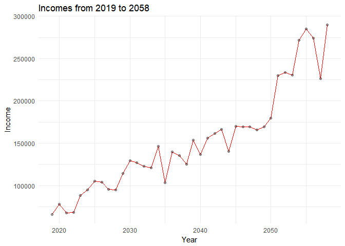

-   [Setting up the simulation for
    the problems.](#setting-up-the-simulation-for-the-problems.)
-   [Question 1.](#question-1.)
-   [Question 2.](#question-2.)
-   [Question 3.](#question-3.)
-   [Question 4.](#question-4.)

Setting up the simulation for the problems.
-------------------------------------------

    set.seed(123)

    # Using a function to create the simulation parameters. 

    inc_ <- function(n_year, s_year, n_sample,
                             inc0, mu, sde, p, g){

    # Geenerating the errors within equation using a matrix. 

     error_ln <- t(matrix(rnorm(n_sample * n_year, mean = mu, sd = sde), 
                         nrow = n_year))
     
    # Generating formula for year, logged income and errors.
      
      inc_ln <- matrix(nrow = n_sample, ncol = n_year)
      inc_ln[,1] <- log(inc0) + error_ln[,1]
      for(i in 2 : n_year){
          inc_ln[, i] <- (1 - p) * (log(inc0) + g * (i - 1)) +
            p * inc_ln[, i - 1] + error_ln[, i]
      }

    # Making the data readable for simulation so that  the plots work.  
      year <- c(s_year : (s_year + n_year - 1)) %>%
        as.tibble() %>%
        rename(year = value)
      
      inc_sim4 <- inc_ln %>%
        t() %>%
        as.tibble() %>%
        bind_cols(year) %>%
        gather(ID, inc_ln, 1 : n_sample) %>%
        mutate(inc = exp(inc_ln))
      
      return(inc_sim4)
    }

Question 1.
-----------

    set.seed(123)

    # Generating the data. 

    inc_sim4 <- inc_(n_year = 40, s_year = 2019, n_sample = 10000, 
                           inc0 = 80000, mu = 0, sde = 0.1, p = 0.2, g = 0.03)

    # Graphing

    inc_sim4 %>%
      filter(ID == "V123") %>%
      ggplot(aes(year, inc)) +
      geom_line(color = "red") +
      geom_point(alpha = 1/3, color = "black") +
      labs(title = "Incomes from 2019 to 2058", x = "Year", y = "Income") + 
      theme_minimal()

Question 2.
-----------

### Those making &lt;$70,000 and &gt;$100,000

In 2019, around 8.94% of people make less than $70,000 and around 1.24%
make over $100,000.

    set.seed(123)

    # Filter the year of 2019.

    inc2019 <- inc_sim4 %>%
      filter(year == 2019)

    # Getting percents for the two incomes.

    income_70 <- percent(nrow(filter(inc2019, inc < 70000)) / nrow(inc2019), d = 2)
    income_70

    ## [1] "8.94 %"

    income_100 <- percent(nrow(filter(inc2019, inc > 100000)) / nrow(inc2019), d = 2)
    income_100

    ## [1] "1.24 %"

### Bell Curve Distrobution

In 2019, the data has an almost perfect normal/bell curve distrobution.

    set.seed(123)

    # Generating histrogram 
      
    ggplot(inc2019, aes(inc)) +
      scale_y_continuous(label = scales::percent) +
      scale_x_continuous() +
      geom_histogram(aes(y = ..density..), bins = 50, 
                     fill = "purple", color = "black") +
      stat_function(fun = dnorm, args = list(mean = mean(inc2019$inc), sd = sd(inc2019$inc))) +
      labs(title = "Distribution of Income in 2019", x = "Income", y = "Density") +
      theme_minimal()

Question 3.
-----------

Approximately 18.00% of people could pay off their debts by 2028.

    set.seed(123)

    # Generating data to later calculate those who pay off the debt.

    debt_95k <- inc_sim4 %>%
      group_by(ID) %>%
      mutate(debt_95k = cumsum(0.1 * inc)) %>%
      filter(debt_95k >= 95000) %>%
      group_by(ID) %>%
      filter(debt_95k == min(debt_95k))

    # Calculating how many people paid their loans before 2028.

    debt_success <- percent(nrow(filter(debt_95k, year < 2029)) / nrow(debt_95k), d = 2)
    debt_success

    ## [1] "18.00 %"

    # Graphing

    ggplot(debt_95k, aes(year, ..density..)) +
    geom_histogram(bins = 5, fill = "green", color = "black") +
    scale_y_continuous(label = scales::percent) +
    labs(title = "Distribution of When People Pay Their Loans", x = "Year", y = "Density") +
    theme_minimal()  

Question 4.
-----------

Roughly 70.35% of the people were able to pay their debts back by 2028.

    set.seed(123)

    # Chaning data to account for the changes in distrobution.

    debt_10 <- inc_(n_year = 40, s_year = 2019, n_sample = 10000, 
                           inc0 = 85000, mu = 0, sde = 0.15, p = 0.2, g = 0.03)

    debt_95k_10 <- debt_10 %>%
      group_by(ID) %>%
      mutate(debt_95k_10 = cumsum(0.1 * inc)) %>%
      filter(debt_95k_10 >= 95000) %>%
      group_by(ID) %>%
      filter(debt_95k_10 == min(debt_95k_10))

    # Calculating how many people paid their loans before 2028 with new distrobution.

    debt_success_10 <- percent(nrow(filter(debt_95k_10, year < 2029)) / nrow(debt_95k_10), d = 2)
    debt_success_10

    ## [1] "70.35 %"

    # Graphing

    ggplot(debt_95k_10, aes(year, ..density..)) +
    geom_histogram(bins = 5, fill = "red", color = "black") +
    scale_y_continuous(label = scales::percent) +
    labs(title = "Distrobution of When People Pay Their Loans", x = "Year", y = "Density") +
    theme_minimal()  

